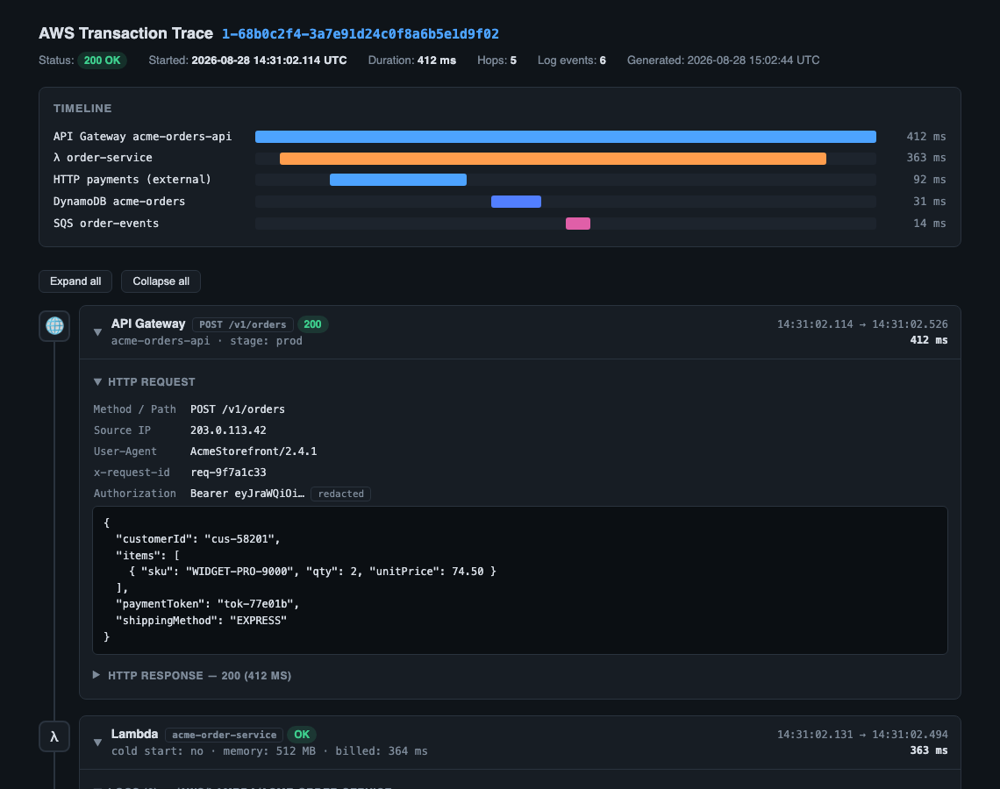
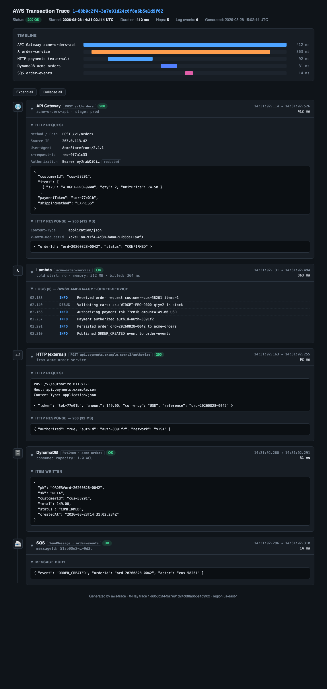

# aws-trace

An **agent skill** that renders a full AWS transaction trace as an interactive HTML timeline
from a single X-Ray trace ID.

Give your agent a trace ID —

> trace 1-68b0c2f4-3a7e91d24c0f8a6b5e1d9f02

— and it gathers the X-Ray segments, pulls the CloudWatch logs for every hop, and produces
one self-contained HTML document in `./.traces/`, opened in your default browser.

## What the output looks like

Header, summary Gantt timeline, and chronological hop cards:



Every hop expands: HTTP requests/responses (headers + body), per-hop CloudWatch logs with
level coloring, DynamoDB items, and message payloads:



A fully rendered mock document is in [examples/example-trace.html](examples/example-trace.html)
— open it in a browser to try the interactivity.

## What it shows

- **Chronological hop flow** — e.g. API Gateway → Lambda → external HTTP → DynamoDB →
  SQS/SNS → downstream consumers, ordered by start time (async hops included).
- **Logs at each stage** — CloudWatch log lines attached to their hop by Lambda request ID,
  with timestamps and level coloring; unmatched events are kept in a trailing section.
- **Any AWS component** — hops are derived from the X-Ray segments themselves, so segment
  types beyond the common ones (Step Functions, EventBridge, S3, …) are rendered with the
  same card pattern rather than dropped ([rules/hop-types.md](rules/hop-types.md)).
- **Safety** — read-only AWS calls, all data HTML-escaped, credential-looking values redacted.

## Repository layout

```
SKILL.md                        the skill definition (entry point agents read)
templates/trace-template.html   canonical CSS/markup/JS the output must use
rules/hop-types.md              per-hop-kind content rules + extension rules
examples/example-trace.html     rendered gold standard
.traces/                        generated output (gitignored)
```

## Installation

Install with the [`skills` CLI](https://github.com/vercel-labs/skills) — no clone needed:

```sh
npx skills add pinhigh-ai/aws-trace
```

It installs the skill for your agent harness(es) — Claude Code, Cursor, Codex, opencode, and
other `.agents/skills`-style locations (which Warp reads too). Target a specific harness with
`-a`, e.g.:

```sh
npx skills add pinhigh-ai/aws-trace -a claude-code
```

Manual alternative: copy (or clone and symlink) this folder into your harness's skills
directory — e.g. `~/.claude/skills/aws-trace` (Claude Code) or `~/.warp/skills/aws-trace`
(Warp). Each skill is just a folder containing `SKILL.md`.

## Customization

[rules/hop-types.md](rules/hop-types.md) is the skill's extension point — it tells the agent
what each hop kind shows and how to handle components it doesn't recognize. Because an
installed skill is just these files, you can tailor it to your organization's tracing by
editing that file (fork the repo, or edit your installed copy directly):

- **Add hop kinds for your own components.** Append a row to the *Known kinds* table with the
  icon, palette color, title pattern, and sections you want — e.g. an internal message broker,
  a payments gateway, or a legacy service that appears in your traces. The agent composes new
  hop cards from that row exactly as it does for the built-in kinds.
- **Add custom log queries.** Add a subsection under *Section content rules* describing the
  extra CloudWatch queries the agent should run for your stack — for example, log groups that
  aren't derivable from X-Ray segments (queue-triggered workers, on-prem forwarders) and the
  `filter-log-events` patterns or correlation-ID fields (`correlationId`, `traceparent`, a
  custom `x-request-id`) that tie those events back to a hop.
- **Reconstruct hops that never reach X-Ray.** If part of your transaction flows through
  infrastructure X-Ray can't see (self-hosted brokers, third-party webhooks), describe the log
  markers that identify a send and a receive, and instruct the agent to synthesize a hop from
  them — following the same card pattern and the *Unknown components* rule.
- **Tune the defaults.** Naming conventions for your log groups, a different log-search
  window, or organization-specific redaction keys can all be stated as additional rules.

Keep [templates/trace-template.html](templates/trace-template.html) untouched so customized
traces still render with the standard look; your rules only change *what* is gathered and
which cards appear, not the styling.

## Requirements

- **AWS CLI** configured with read access to X-Ray (`xray:BatchGetTraces`) and CloudWatch Logs
  (`logs:FilterLogEvents`, `logs:DescribeLogGroups`) in the account/region of the trace.
  The skill uses your default credential chain (`AWS_PROFILE`, SSO, env vars).
- X-Ray tracing enabled on the services involved.

## Usage

Ask your agent, in a directory where you want `.traces/` created:

- `trace 1-68b0c2f4-3a7e91d24c0f8a6b5e1d9f02`
- `show me the full trace for 1-… using profile staging`
- `trace 1-… and include the /aws/lambda/acme-notify-service log group`

Options are conversational — profile, region, log-search window, extra log groups, or
"don't open the browser" can all be stated in the request.
